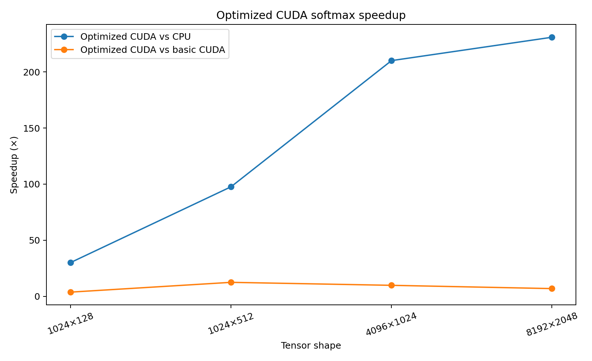

# CUDA Softmax Performance Benchmark

A focused GPU-programming project that implements and benchmarks row-wise softmax three ways:

1. A numerically stable C++ CPU reference.
2. A deliberately simple CUDA kernel with one GPU thread per row.
3. An optimized CUDA kernel with one thread block per row, strided element processing, shared-memory reductions, and block synchronization.

A separate PyTorch implementation provides an external framework reference and its own CPU/GPU timing baseline.

> Measurement integrity: all published performance values are accompanied by
> raw result files, benchmark methodology, numerical validation, and the
> hardware/software environment available from the benchmark run.

## Why this is more than vector addition

The project demonstrates concrete engineering work relevant to AI software and GPU systems:

- numerically stable floating-point computation;
- C++17 and CUDA C++ kernels;
- thread/block decomposition;
- shared-memory max and sum reductions;
- synchronization with `__syncthreads()`;
- correctness validation against an independent CPU implementation;
- maximum absolute error, relative error, and row-sum error;
- CUDA-event latency measurement after warmup;
- comparison across multiple tensor shapes;
- PyTorch framework validation and benchmarking;
- reproducible CSV output and plots.

## Softmax definition and numerical stability

For each row `x`, softmax is:

```text
softmax(x_i) = exp(x_i) / sum_j(exp(x_j))
```

The direct form can overflow for large logits. All implementations use the mathematically equivalent stable form:

```text
softmax(x_i) = exp(x_i - max(x)) / sum_j(exp(x_j - max(x)))
```

Subtracting the row maximum guarantees that the largest exponent is `exp(0) = 1`, greatly reducing overflow risk.

## Implementations

### CPU reference

`src/cpu_softmax.cpp` processes one row at a time. It finds the maximum in `float`, evaluates exponentials with `double` intermediates, accumulates the denominator in `double`, and writes `float32` output. This is the correctness reference for the CUDA kernels.

### Basic CUDA kernel

`softmax_basic_kernel` assigns one CUDA thread to one complete row. Each thread performs the row maximum, exponential sum, and normalization sequentially. It is valid GPU code, but exposes little parallelism within a row and serves as the optimization baseline.

### Optimized CUDA kernel

`softmax_optimized_kernel` assigns one CUDA block to one row:

- threads traverse columns in a strided loop;
- each thread computes a local maximum;
- shared memory reduces local maxima to the row maximum;
- threads compute exponentials and local partial sums;
- shared memory reduces partial sums to the denominator;
- threads normalize their assigned output elements.

The reduction requires a power-of-two block size between 32 and 1024. The default is 256 threads.

## Repository layout

```text
.
├── CMakeLists.txt
├── CMakePresets.json
├── include/
│   ├── cuda_check.cuh
│   └── softmax.hpp
├── src/
│   ├── cpu_softmax.cpp
│   ├── main.cu
│   └── softmax_kernels.cu
├── python/
│   ├── plot_results.py
│   └── pytorch_reference.py
├── scripts/
│   └── run_benchmarks.py
├── tests/
│   ├── cpu_softmax_test.cpp
│   └── test_reference.py
└── results/
```

## Requirements

- NVIDIA GPU with a CUDA-capable driver
- NVIDIA CUDA Toolkit with `nvcc`
- CMake 3.24 or newer
- Ninja or another CMake generator
- C++17 compiler supported by the installed CUDA Toolkit
- Python 3.10 or newer
- PyTorch, Matplotlib, and pytest

CMake defaults to the native compute capability of the installed GPU. For a portable binary, configure explicitly, for example `cmake --preset release -DCMAKE_CUDA_ARCHITECTURES="75;80;86;89"`.

## Build

### Linux or WSL2

```bash
python -m venv .venv
source .venv/bin/activate
python -m pip install -r requirements.txt

cmake --preset release
cmake --build --preset release
```

### Windows PowerShell

Use a Visual Studio Developer PowerShell with the CUDA Toolkit available:

```powershell
py -m venv .venv
.\.venv\Scripts\Activate.ps1
python -m pip install -r requirements.txt

cmake --preset release
cmake --build --preset release
```

If Ninja is unavailable, either install it or replace the preset generator with a Visual Studio generator.

## Run the complete benchmark suite

```bash
python scripts/run_benchmarks.py
```

The script builds the executable, benchmarks the CPU/basic CUDA/optimized CUDA implementations, benchmarks `torch.softmax` on the same shapes, and generates plots.

Custom example:

```bash
python scripts/run_benchmarks.py \
  --sizes 256x128,1024x512,4096x1024,8192x2048 \
  --warmup 30 \
  --iterations 200 \
  --threads 256
```

Direct executable usage:

```bash
./build/release/softmax_benchmark \
  --sizes 1024x128,1024x512,4096x1024,8192x2048 \
  --warmup 20 \
  --iterations 100 \
  --threads 256 \
  --output results/benchmark_results.csv
```

On Windows, use `build\release\softmax_benchmark.exe`.

## Benchmark methodology

For each tensor shape:

1. Generate deterministic normally distributed `float32` logits with a fixed seed.
2. Run the stable C++ CPU implementation and retain its output as the reference.
3. Copy the input to the GPU before timing; host-to-device transfer is intentionally excluded from kernel latency.
4. Warm up each CUDA kernel to reduce first-launch and initialization effects.
5. Record a CUDA start event, launch the kernel repeatedly, record a stop event, synchronize on the stop event, and divide elapsed time by the iteration count.
6. Copy each CUDA result to the CPU after timing.
7. Compare every output element to the CPU reference.
8. Record maximum absolute error, maximum relative error, and maximum row-sum error.
9. Write device name, CUDA versions, compute capability, configuration, latency, errors, and speedups to CSV.

The CPU implementation uses at most 10 timed repetitions to prevent very large shapes from making the benchmark unnecessarily slow. CUDA kernels use the full requested iteration count.

## Accuracy metrics

For reference value `r` and candidate value `c`:

```text
absolute_error = |r - c|
relative_error = |r - c| / max(|r|, 1e-8)
```

Relative error can look large for probabilities near zero, so the benchmark reports both metrics. It also checks that each output row sums to approximately one. The executable fails if maximum absolute error or maximum row-sum error exceeds `2e-5`.

## Results

The executable generates `results/benchmark_results.csv` with the following key columns:

| Shape | CPU ms | Basic CUDA ms | Optimized CUDA ms | Optimized vs. basic | Max abs. error | Max rel. error |
|---|---:|---:|---:|---:|---:|---:|
| 1024x128 | generated locally | generated locally | generated locally | generated locally | generated locally | generated locally |
| 1024x512 | generated locally | generated locally | generated locally | generated locally | generated locally | generated locally |
| 4096x1024 | generated locally | generated locally | generated locally | generated locally | generated locally | generated locally |
| 8192x2048 | generated locally | generated locally | generated locally | generated locally | generated locally | generated locally |

After running the suite, `results/RESULTS.md` is generated automatically. Use its measured table to replace the placeholders above, then add:

- GPU model and VRAM;
- CUDA runtime and driver versions;
- CPU model;
- operating system;
- compiler versions;
- whether `SOFTMAX_ENABLE_FAST_MATH` was enabled;
- one or two observations explaining where the optimized kernel wins or loses.

Generate charts with:

```bash
python python/plot_results.py
```

This creates:

- `results/latency.png`
- `results/speedup.png`
- `results/RESULTS.md`, a hardware-labeled Markdown table suitable for committing

## PyTorch reference

Run PyTorch separately on CUDA:

```bash
python python/pytorch_reference.py --device cuda
```

Or validate the reference logic without a GPU:

```bash
python python/pytorch_reference.py --device cpu --sizes 32x257 --iterations 5
```

The script compares explicit stable softmax against `torch.softmax`, records maximum errors, benchmarks with CUDA events on GPU, and writes `results/pytorch_results.csv`.

## Published CUDA softmax results

The benchmark compares a serial C++ reference, a basic CUDA kernel, and an
optimized shared-memory reduction kernel on an NVIDIA Tesla T4.

| Shape | CPU | Basic CUDA | Optimized CUDA | Optimized vs CPU | Optimized vs Basic |
|---|---:|---:|---:|---:|---:|
| 1024 × 128 | 1.189 ms | 0.147 ms | 0.040 ms | 30.06× | 3.72× |
| 1024 × 512 | 4.911 ms | 0.626 ms | 0.050 ms | 97.60× | **12.44×** |
| 4096 × 1024 | 40.537 ms | 1.888 ms | 0.193 ms | 210.06× | 9.78× |
| 8192 × 2048 | 162.082 ms | 4.820 ms | 0.702 ms | **230.88×** | 6.87× |

Across the suite, the optimized implementation achieved up to **230.88×**
speedup over the serial CPU reference and up to **12.44×** over the basic CUDA
kernel. Optimized-kernel maximum absolute error remained below **3.6e-7**.

The raw measurements, methodology, correctness results, and figures are in
[`results/CUDA_RESULTS.md`](results/CUDA_RESULTS.md).



## Tests

Python correctness tests:

```bash
pytest -q
```

CPU C++ correctness test without CUDA:

```bash
g++ -std=c++17 -Wall -Wextra -Wpedantic \
  -Iinclude src/cpu_softmax.cpp tests/cpu_softmax_test.cpp \
  -o cpu_softmax_test
./cpu_softmax_test
```

CUDA smoke test after building:

```bash
ctest --preset release
```

For deeper CUDA debugging, run NVIDIA Compute Sanitizer against a small input:

```bash
compute-sanitizer ./build/release/softmax_benchmark \
  --sizes 16x31,32x257 \
  --warmup 1 \
  --iterations 2
```

## Optimization experiments

The current optimized kernel is intentionally understandable rather than maximally specialized. Useful next experiments include:

- warp-shuffle reductions to reduce shared-memory traffic and synchronization;
- vectorized `float4` loads when column alignment allows it;
- specialized kernels for small, medium, and large column counts;
- half or bfloat16 input with float accumulation;
- occupancy and memory-throughput analysis with Nsight Compute;
- a fused PyTorch custom operator using `torch.utils.cpp_extension`;
- backward-pass implementation and gradient checks.

A fast-math build is available for a controlled speed/accuracy comparison:

```bash
cmake --preset release-fast-math
cmake --build --preset release-fast-math
```

Do not combine fast-math results with standard results without labeling the configuration.

## Technical references

- NVIDIA CUDA Programming Guide: https://docs.nvidia.com/cuda/cuda-programming-guide/index.html
- CUDA kernel and synchronization guide: https://docs.nvidia.com/cuda/cuda-programming-guide/02-basics/writing-cuda-kernels.html
- PyTorch CUDA semantics and timing: https://docs.pytorch.org/docs/stable/notes/cuda.html
- PyTorch custom C++ and CUDA operators: https://docs.pytorch.org/tutorials/advanced/cpp_custom_ops.html

## Resume-safe description

After running and documenting real results, a defensible resume bullet would be:

> Implemented numerically stable softmax in C++ and CUDA, then optimized row-wise GPU execution using block-level shared-memory reductions; validated floating-point accuracy against CPU and PyTorch references and benchmarked latency across multiple tensor shapes with CUDA events.

Add a numerical speedup only after measuring it on your hardware and committing the generated results.
