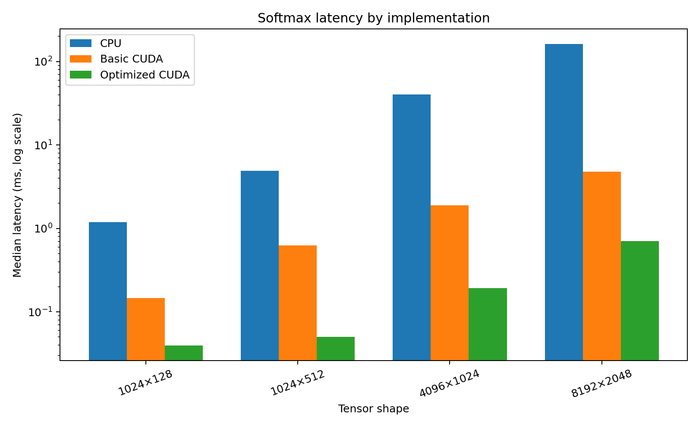

# CUDA softmax benchmark results

## Summary

The benchmark compares three numerically stable row-wise softmax implementations:

1. A serial C++ CPU reference
2. A basic CUDA implementation
3. An optimized CUDA implementation using shared-memory reductions

All measurements were collected on an **NVIDIA Tesla T4** with CUDA runtime
**12.8**, compute capability **7.5**, fast math enabled, **256 threads per
block**, **20 warm-up iterations**, and **100 timed iterations**.

The optimized kernel achieved:

- Up to **230.88× speedup over the serial CPU reference**
- Up to **12.44× speedup over the basic CUDA kernel**
- Optimized-kernel maximum absolute error no greater than **3.58e-7**
- Optimized row-sum error no greater than **3.49e-7**

The strongest GPU-to-GPU improvement occurred for the **1024 × 512** tensor:
the optimized kernel reduced latency from **0.6261 ms** to **0.0503 ms**, a
**12.44× speedup**, while reaching **97.60× speedup over CPU** on the same
workload.

## Measured results

| Shape | Elements | CPU (ms) | Basic CUDA (ms) | Optimized CUDA (ms) | Basic vs CPU | Optimized vs CPU | Optimized vs Basic | Optimized max abs. error |
|---|---:|---:|---:|---:|---:|---:|---:|---:|
| 1024 × 128 | 131,072 | 1.1893 | 0.1473 | 0.0396 | 8.07× | 30.06× | 3.72× | 1.79e-7 |
| 1024 × 512 | 524,288 | 4.9110 | 0.6261 | 0.0503 | 7.84× | 97.60× | **12.44×** | 2.38e-7 |
| 4096 × 1024 | 4,194,304 | 40.5373 | 1.8880 | 0.1930 | 21.47× | 210.06× | 9.78× | 1.79e-7 |
| 8192 × 2048 | 16,777,216 | 162.0815 | 4.8197 | 0.7020 | 33.63× | **230.88×** | 6.87× | 3.58e-7 |

## Methodology

- GPU: NVIDIA Tesla T4
- CUDA runtime: 12.8
- CUDA driver API version reported by the benchmark: 13
- Compute capability: 7.5
- Fast math: enabled
- Threads per block: 256
- Warm-up iterations: 20
- Timed iterations: 100
- Shapes: 1024 × 128 through 8192 × 2048
- Correctness metrics:
  - Maximum absolute error
  - Maximum relative error
  - Maximum row-sum error

The CPU implementation serves as the numerical reference. The optimized kernel
was also compared directly against the basic CUDA implementation to isolate the
effect of GPU-kernel optimization from the general benefit of GPU execution.

## Result interpretation

The **230.88× CPU speedup** and **12.44× basic-CUDA speedup** are maxima from
different tensor shapes. They must not be presented as if both occurred in the
same benchmark case.

For one same-workload comparison, use the 1024 × 512 result:

> Reduced CUDA softmax latency from 0.626 ms to 0.050 ms, achieving 12.44×
> speedup over the baseline CUDA kernel and 97.60× over the serial CPU reference.

For an across-suite maximum statement, use:

> Achieved up to 230.88× speedup over a serial CPU reference and up to 12.44×
> over a baseline CUDA kernel.

## Figures

## Raw data

The complete benchmark output is available in
[`cuda_softmax_benchmark.csv`](cuda_softmax_benchmark.csv).
