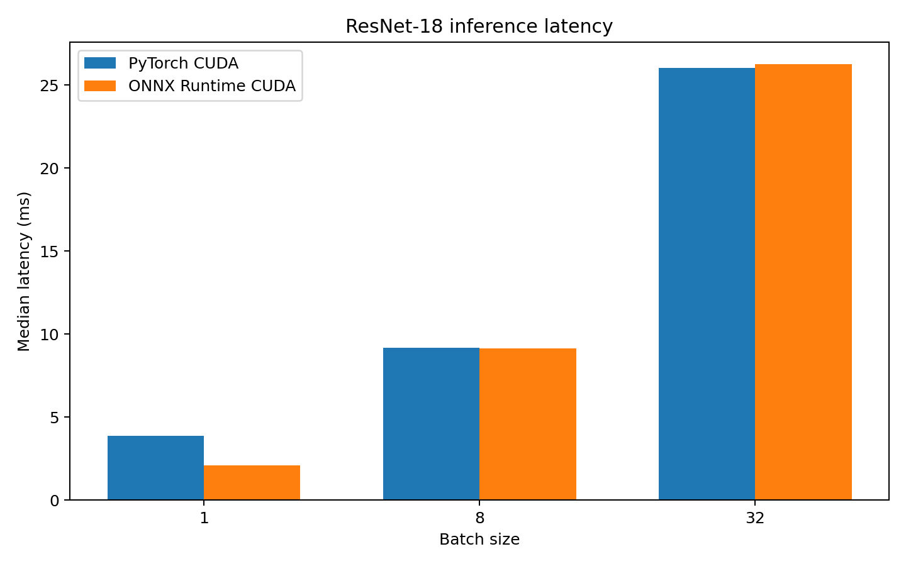

# ONNX Runtime CUDA benchmark results

## Summary

A pretrained ResNet-18 model was exported from PyTorch to ONNX with a dynamic
batch dimension and benchmarked using ONNX Runtime's CUDA Execution Provider.

At batch size 1, ONNX Runtime reduced median latency from **3.858 ms to
2.105 ms**, a **45.4% reduction**, and increased throughput from **259.2 to
475.1 images/second**, a **1.83× improvement**.

At batch size 8, performance was effectively tied. At batch size 32, PyTorch
was approximately 0.9% faster. The results therefore support a batch-size-1
latency claim, not a universal ONNX speedup claim.

## Measurements

| Batch | PyTorch median (ms) | PyTorch p95 (ms) | PyTorch images/s | ONNX median (ms) | ONNX p95 (ms) | ONNX images/s | ONNX speedup | Latency reduction | Max abs. error |
|---:|---:|---:|---:|---:|---:|---:|---:|---:|---:|
| 1 | 3.858 | 4.727 | 259.2 | 2.105 | 3.238 | 475.1 | 1.833× | 45.44% | 6e-6 |
| 8 | 9.184 | 9.347 | 871.1 | 9.117 | 9.239 | 877.5 | 1.007× | 0.73% | 8e-6 |
| 32 | 26.023 | 26.934 | 1229.7 | 26.266 | 28.593 | 1218.3 | 0.991× | -0.93% | 1.3e-5 |

## Methodology

- Model: pretrained torchvision ResNet-18
- Input: FP32, `[batch, 3, 224, 224]`
- Batch sizes: 1, 8, and 32
- Warm-up iterations: 10
- Timed iterations: 50
- PyTorch timing: CUDA events
- ONNX Runtime timing: synchronized wall-clock timing
- ONNX input/output: GPU-resident with I/O binding
- Active primary provider: `CUDAExecutionProvider`
- Numerical validation: maximum absolute output difference from PyTorch

## Reproducibility limitation

The original run preserved its measurements and active provider but did not
preserve complete GPU, package, CUDA, and driver metadata. Rerunning
`python/onnx_runtime_benchmark.py` writes
`onnx_runtime_environment.json` automatically.

## Figure

## Raw data

[`onnx_runtime_cuda_benchmark.csv`](onnx_runtime_cuda_benchmark.csv)
