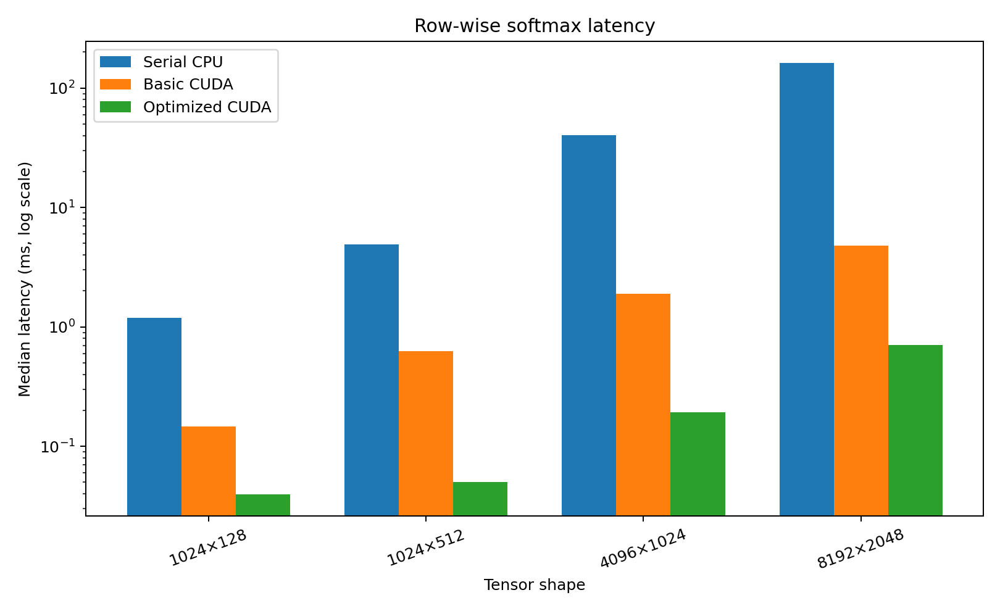
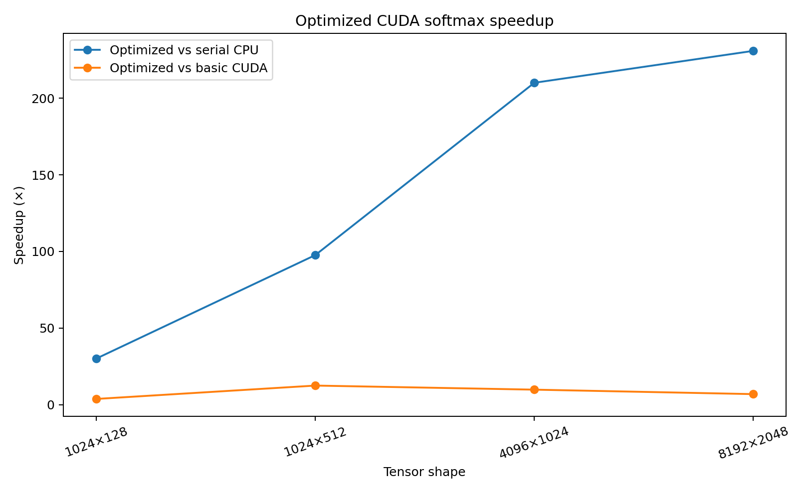

# CUDA softmax benchmark results

## Summary

Three numerically stable row-wise softmax implementations were benchmarked:

1. Serial C++ reference
2. Basic CUDA kernel with one thread per row
3. Optimized CUDA kernel with one block per row and shared-memory reductions

The optimized kernel achieved up to **230.88× speedup over the serial CPU
reference** and up to **12.44× speedup over the basic CUDA kernel**. Those
maxima occur at different tensor shapes.

For a single same-workload comparison, the `1024 × 512` case reduced latency
from **0.6261 ms to 0.0503 ms**, producing **12.44× speedup over basic CUDA**
and **97.60× speedup over the serial CPU reference**.

## Environment

- GPU: NVIDIA Tesla T4
- CUDA runtime: 12.8
- CUDA driver API version: 13.0
- Compute capability: 7.5
- Fast math: enabled
- Threads per block: 256
- Warm-up iterations: 20
- Timed iterations: 100
- Timing: CUDA events
- Transfer time: excluded

## Latency and speedup

| Shape | Elements | CPU (ms) | Basic CUDA (ms) | Optimized CUDA (ms) | Basic vs CPU | Optimized vs CPU | Optimized vs basic |
|---|---:|---:|---:|---:|---:|---:|---:|
| 1024 × 128 | 131,072 | 1.1893 | 0.1473 | 0.0396 | 8.07× | 30.06× | 3.72× |
| 1024 × 512 | 524,288 | 4.9110 | 0.6261 | 0.0503 | 7.84× | 97.60× | **12.44×** |
| 4096 × 1024 | 4,194,304 | 40.5373 | 1.8880 | 0.1930 | 21.47× | 210.06× | 9.78× |
| 8192 × 2048 | 16,777,216 | 162.0815 | 4.8197 | 0.7020 | 33.63× | **230.88×** | 6.87× |

## Numerical validation

| Shape | Basic max abs. | Basic max rel. | Basic row-sum error | Optimized max abs. | Optimized max rel. | Optimized row-sum error |
|---|---:|---:|---:|---:|---:|---:|
| 1024 × 128 | 6.56e-7 | 2.06e-6 | 7.27e-7 | 1.79e-7 | 1.79e-6 | 2.42e-7 |
| 1024 × 512 | 8.94e-7 | 2.75e-6 | 1.21e-6 | 2.38e-7 | 2.00e-6 | 2.56e-7 |
| 4096 × 1024 | 2.74e-6 | 4.67e-6 | 3.04e-6 | 1.79e-7 | 2.05e-6 | 2.71e-7 |
| 8192 × 2048 | 6.26e-6 | 8.17e-6 | 6.54e-6 | 3.58e-7 | 2.13e-6 | 3.49e-7 |

The executable fails when maximum absolute error or maximum row-sum error
exceeds `2e-5`.

## Fairness notes

- The CPU implementation is a serial numerical reference, not an optimized
  multithreaded library.
- CUDA timings measure kernel execution and exclude host/device transfers.
- Published measurements use the fast-math build and are labeled accordingly.
- The largest CPU speedup and largest basic-CUDA speedup occur at different
  tensor shapes.

## Figures

## Raw data

[`benchmark_results.csv`](benchmark_results.csv)
